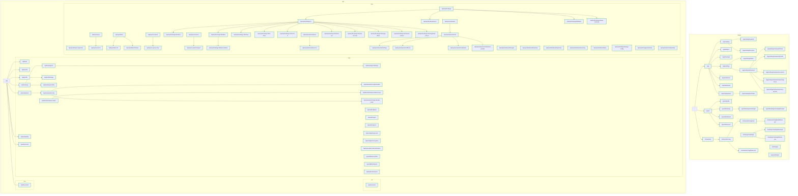

```mermaid
flowchart TD
    subgraph Pages
        restaurants["/restaurants"]
        class restaurants public;
        root["/"]
        app["/app"]
        class app public;
        guest["/guest"]
        class guest public;
        restaurants__slug["/restaurants/:slug"]
        class restaurants__slug public;
        auth_signin["/auth/signin"]
        class auth_signin public;
        bookings__bookingId["/bookings/:bookingId"]
        class bookings__bookingId public;
        app_bookings["/app/bookings"]
        class app_bookings public;
        app_customers["/app/customers"]
        class app_customers public;
        app_dashboard["/app/dashboard"]
        class app_dashboard public;
        app_management["/app/management"]
        class app_management public;
        app_seating["/app/seating"]
        class app_seating public;
        app_settings["/app/settings"]
        class app_settings public;
        app_walk_in["/app/walk-in"]
        class app_walk_in public;
        guest_bookings["/guest/bookings"]
        class guest_bookings public;
        guest_dashboard["/guest/dashboard"]
        class guest_dashboard public;
        guest_profile["/guest/profile"]
        class guest_profile public;
        guest_thank_you["/guest/thank-you"]
        class guest_thank_you public;
        restaurants__slug_book["/restaurants/:slug/book"]
        class restaurants__slug_book public;
        restaurants__slug_thank_you["/restaurants/:slug/thank-you"]
        class restaurants__slug_thank_you public;
        bookings__bookingId_manage["/bookings/:bookingId/manage"]
        class bookings__bookingId_manage public;
        bookings__bookingId_thank_you["/bookings/:bookingId/thank-you"]
        class bookings__bookingId_thank_you public;
        app_management_team["/app/management/team"]
        class app_management_team public;
        app_seating_capacity["/app/seating/capacity"]
        class app_seating_capacity public;
        app_seating_floor_plan["/app/seating/floor-plan"]
        class app_seating_floor_plan public;
        app_settings_restaurant["/app/settings/restaurant"]
        class app_settings_restaurant public;
        app_settings_tables["/app/settings/tables"]
        class app_settings_tables public;
        app_auth_signin["/app/auth/signin"]
        class app_auth_signin public;
        guest_bookings__bookingId["/guest/bookings/:bookingId"]
        class guest_bookings__bookingId public;
        restaurants__slug_book_thank_you["/restaurants/:slug/book/thank-you"]
        class restaurants__slug_book_thank_you public;
        app_settings_restaurant_occasions["/app/settings/restaurant/occasions"]
        class app_settings_restaurant_occasions public;
        app_settings_restaurant_operating_hours["/app/settings/restaurant/operating-hours"]
        class app_settings_restaurant_operating_hours public;
        app_settings_restaurant_profile["/app/settings/restaurant/profile"]
        class app_settings_restaurant_profile public;
        app_settings_restaurant_service_periods["/app/settings/restaurant/service-periods"]
        class app_settings_restaurant_service_periods public;
        app_settings_restaurant_team["/app/settings/restaurant/team"]
        class app_settings_restaurant_team public;
        guest_bookings__bookingId_receipt["/guest/bookings/:bookingId/receipt"]
        class guest_bookings__bookingId_receipt public;
    end

    subgraph API
        api["/api"]
        subgraph Core
            api_auth_callback["/api/auth/callback"]
            class api_auth_callback public;
            api_auth_signin["/api/auth/signin"]
            class api_auth_signin public;
            api_auth_signout["/api/auth/signout"]
            class api_auth_signout public;
            api_availability["/api/availability"]
            class api_availability public;
            api_bookings__id_history["/api/bookings/:id/history"]
            class api_bookings__id_history public;
            api_bookings__id["/api/bookings/:id"]
            class api_bookings__id public;
            api_bookings_confirm["/api/bookings/confirm"]
            class api_bookings_confirm public;
            api_bookings["/api/bookings"]
            class api_bookings public;
            api_client_error["/api/client-error"]
            class api_client_error public;
            api_config_merge_rules["/api/config/merge-rules"]
            class api_config_merge_rules public;
            api_config_service_policy["/api/config/service-policy"]
            class api_config_service_policy public;
            api_events["/api/events"]
            class api_events public;
            api_lead["/api/lead"]
            class api_lead public;
            api_profile_image["/api/profile/image"]
            class api_profile_image public;
            api_profile["/api/profile"]
            class api_profile public;
            api_reservations__id_confirmation["/api/reservations/:id/confirmation"]
            class api_reservations__id_confirmation public;
            api_restaurants__slug_calendar_mask["/api/restaurants/:slug/calendar-mask"]
            class api_restaurants__slug_calendar_mask public;
            api_restaurants__slug["/api/restaurants/:slug"]
            class api_restaurants__slug public;
            api_restaurants__slug_schedule["/api/restaurants/:slug/schedule"]
            class api_restaurants__slug_schedule public;
            api_restaurants["/api/restaurants"]
            class api_restaurants public;
            api_staff_auto_confirm["/api/staff/auto/confirm"]
            class api_staff_auto_confirm public;
            api_staff_auto_quote["/api/staff/auto/quote"]
            class api_staff_auto_quote public;
            api_team_invitations__token_accept["/api/team/invitations/:token/accept"]
            class api_team_invitations__token_accept public;
            api_team_invitations__token["/api/team/invitations/:token"]
            class api_team_invitations__token public;
            api_webhook_resend["/api/webhook/resend"]
            class api_webhook_resend public;
        end
        subgraph v1
            api_v1_events["/api/v1/events"]
            class api_v1_events public;
        end
        subgraph Test
            api_test_email["/api/test-email"]
            class api_test_email public;
        end
        subgraph Ops
            api_ops_allowed_capacities["/api/ops/allowed-capacities"]
            class api_ops_allowed_capacities public;
            api_ops_bookings__id_assign_tables["/api/ops/bookings/:id/assign-tables"]
            class api_ops_bookings__id_assign_tables public;
            api_ops_bookings__id_assignment_context["/api/ops/bookings/:id/assignment-context"]
            class api_ops_bookings__id_assignment_context public;
            api_ops_bookings__id_check_in["/api/ops/bookings/:id/check-in"]
            class api_ops_bookings__id_check_in public;
            api_ops_bookings__id_check_out["/api/ops/bookings/:id/check-out"]
            class api_ops_bookings__id_check_out public;
            api_ops_bookings__id_history["/api/ops/bookings/:id/history"]
            class api_ops_bookings__id_history public;
            api_ops_bookings__id_manual_context["/api/ops/bookings/:id/manual-context"]
            class api_ops_bookings__id_manual_context public;
            api_ops_bookings__id_no_show["/api/ops/bookings/:id/no-show"]
            class api_ops_bookings__id_no_show public;
            api_ops_bookings__id["/api/ops/bookings/:id"]
            class api_ops_bookings__id public;
            api_ops_bookings__id_status["/api/ops/bookings/:id/status"]
            class api_ops_bookings__id_status public;
            api_ops_bookings__id_tables__tableId["/api/ops/bookings/:id/tables/:tableId"]
            class api_ops_bookings__id_tables__tableId public;
            api_ops_bookings__id_tables["/api/ops/bookings/:id/tables"]
            class api_ops_bookings__id_tables public;
            api_ops_bookings__id_undo_no_show["/api/ops/bookings/:id/undo-no-show"]
            class api_ops_bookings__id_undo_no_show public;
            api_ops_bookings_disabled["/api/ops/bookings/disabled"]
            class api_ops_bookings_disabled public;
            api_ops_bookings_export["/api/ops/bookings/export"]
            class api_ops_bookings_export public;
            api_ops_bookings["/api/ops/bookings"]
            class api_ops_bookings public;
            api_ops_bookings_status_summary["/api/ops/bookings/status-summary"]
            class api_ops_bookings_status_summary public;
            api_ops_customers_export["/api/ops/customers/export"]
            class api_ops_customers_export public;
            api_ops_customers["/api/ops/customers"]
            class api_ops_customers public;
            api_ops_dashboard_changes["/api/ops/dashboard/changes"]
            class api_ops_dashboard_changes public;
            api_ops_dashboard_heatmap["/api/ops/dashboard/heatmap"]
            class api_ops_dashboard_heatmap public;
            api_ops_dashboard_rejections["/api/ops/dashboard/rejections"]
            class api_ops_dashboard_rejections public;
            api_ops_dashboard_summary["/api/ops/dashboard/summary"]
            class api_ops_dashboard_summary public;
            api_ops_dashboard_vips["/api/ops/dashboard/vips"]
            class api_ops_dashboard_vips public;
            api_ops_occasions__key["/api/ops/occasions/:key"]
            class api_ops_occasions__key public;
            api_ops_occasions["/api/ops/occasions"]
            class api_ops_occasions public;
            api_ops_restaurants__id_details["/api/ops/restaurants/:id/details"]
            class api_ops_restaurants__id_details public;
            api_ops_restaurants__id_hours["/api/ops/restaurants/:id/hours"]
            class api_ops_restaurants__id_hours public;
            api_ops_restaurants__id_logo["/api/ops/restaurants/:id/logo"]
            class api_ops_restaurants__id_logo public;
            api_ops_restaurants__id["/api/ops/restaurants/:id"]
            class api_ops_restaurants__id public;
            api_ops_restaurants__id_service_periods["/api/ops/restaurants/:id/service-periods"]
            class api_ops_restaurants__id_service_periods public;
            api_ops_restaurants["/api/ops/restaurants"]
            class api_ops_restaurants public;
            api_ops_settings_strategic_config["/api/ops/settings/strategic-config"]
            class api_ops_settings_strategic_config public;
            api_ops_strategies_simulate["/api/ops/strategies/simulate"]
            class api_ops_strategies_simulate public;
            api_ops_tables__id["/api/ops/tables/:id"]
            class api_ops_tables__id public;
            api_ops_tables["/api/ops/tables"]
            class api_ops_tables public;
            api_ops_tables_timeline["/api/ops/tables/timeline"]
            class api_ops_tables_timeline public;
            api_ops_team_invitations__id["/api/ops/team/invitations/:id"]
            class api_ops_team_invitations__id public;
            api_ops_team_invitations["/api/ops/team/invitations"]
            class api_ops_team_invitations public;
            api_ops_team_memberships["/api/ops/team/memberships"]
            class api_ops_team_memberships public;
            api_ops_zones__id["/api/ops/zones/:id"]
            class api_ops_zones__id public;
            api_ops_zones["/api/ops/zones"]
            class api_ops_zones public;
        end
    end
    root --> app
    root --> guest
    root --> restaurants
    app --> app_seating
    app --> app_walk_in
    app --> app_bookings
    app --> app_settings
    app --> app_customers
    app --> app_dashboard
    guest --> guest_profile
    app --> app_management
    guest --> guest_bookings
    guest --> guest_dashboard
    guest --> guest_thank_you
    restaurants --> restaurants__slug
    app_management --> app_management_team
    app_settings --> app_settings_tables
    app_seating --> app_seating_capacity
    restaurants__slug --> restaurants__slug_book
    app_seating --> app_seating_floor_plan
    app_settings --> app_settings_restaurant
    guest_bookings --> guest_bookings__bookingId
    bookings__bookingId --> bookings__bookingId_manage
    restaurants__slug --> restaurants__slug_thank_you
    app_settings_restaurant --> app_settings_restaurant_team
    bookings__bookingId --> bookings__bookingId_thank_you
    app_settings_restaurant --> app_settings_restaurant_profile
    restaurants__slug_book --> restaurants__slug_book_thank_you
    app_settings_restaurant --> app_settings_restaurant_occasions
    guest_bookings__bookingId --> guest_bookings__bookingId_receipt
    app_settings_restaurant --> app_settings_restaurant_operating_hours
    app_settings_restaurant --> app_settings_restaurant_service_periods
    api --> api_lead
    api --> api_events
    api --> api_profile
    api --> api_bookings
    api --> api_test_email
    api --> api_restaurants
    api --> api_availability
    api_bookings --> api_bookings__id
    api --> api_client_error
    api_ops_zones --> api_ops_zones__id
    api_profile --> api_profile_image
    api_ops_tables --> api_ops_tables__id
    api_bookings --> api_bookings_confirm
    api_ops_bookings --> api_ops_bookings__id
    api_restaurants --> api_restaurants__slug
    api_ops_occasions --> api_ops_occasions__key
    api_ops_bookings --> api_ops_bookings_export
    api_ops_restaurants --> api_ops_restaurants__id
    api_ops_tables --> api_ops_tables_timeline
    api_bookings__id --> api_bookings__id_history
    api_ops_customers --> api_ops_customers_export
    api_ops_bookings --> api_ops_bookings_disabled
    api_ops_bookings__id --> api_ops_bookings__id_status
    api_ops_bookings__id --> api_ops_bookings__id_tables
    api_ops_bookings__id --> api_ops_bookings__id_history
    api_ops_bookings__id --> api_ops_bookings__id_no_show
    api_ops_restaurants__id --> api_ops_restaurants__id_logo
    api_ops_team_invitations --> api_ops_team_invitations__id
    api_ops_bookings__id --> api_ops_bookings__id_check_in
    api_ops_restaurants__id --> api_ops_restaurants__id_hours
    api_ops_bookings__id --> api_ops_bookings__id_check_out
    api_restaurants__slug --> api_restaurants__slug_schedule
    api_ops_bookings --> api_ops_bookings_status_summary
    api_ops_restaurants__id --> api_ops_restaurants__id_details
    api_ops_bookings__id --> api_ops_bookings__id_undo_no_show
    api_ops_bookings__id --> api_ops_bookings__id_assign_tables
    api_team_invitations__token --> api_team_invitations__token_accept
    api_ops_bookings__id --> api_ops_bookings__id_manual_context
    api_restaurants__slug --> api_restaurants__slug_calendar_mask
    api_ops_bookings__id_tables --> api_ops_bookings__id_tables__tableId
    api_ops_bookings__id --> api_ops_bookings__id_assignment_context
    api_ops_restaurants__id --> api_ops_restaurants__id_service_periods
    classDef public stroke:#16a34a,stroke-width:2px;
    classDef auth stroke:#2563eb,stroke-width:2px;
    classDef admin stroke:#dc2626,stroke-width:2px;
    classDef owner stroke:#7c3aed,stroke-width:2px;
    classDef mixed stroke:#f59e0b,stroke-width:2px;
```
